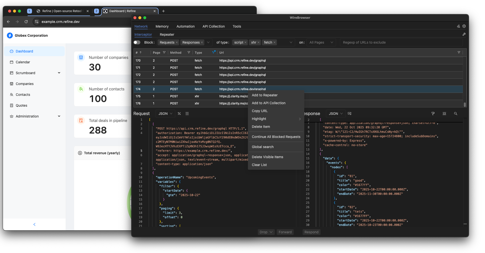
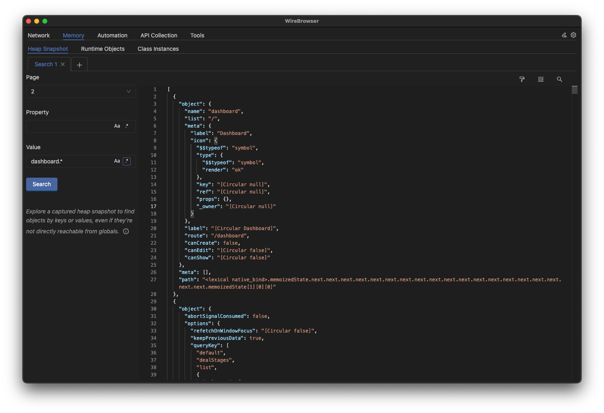
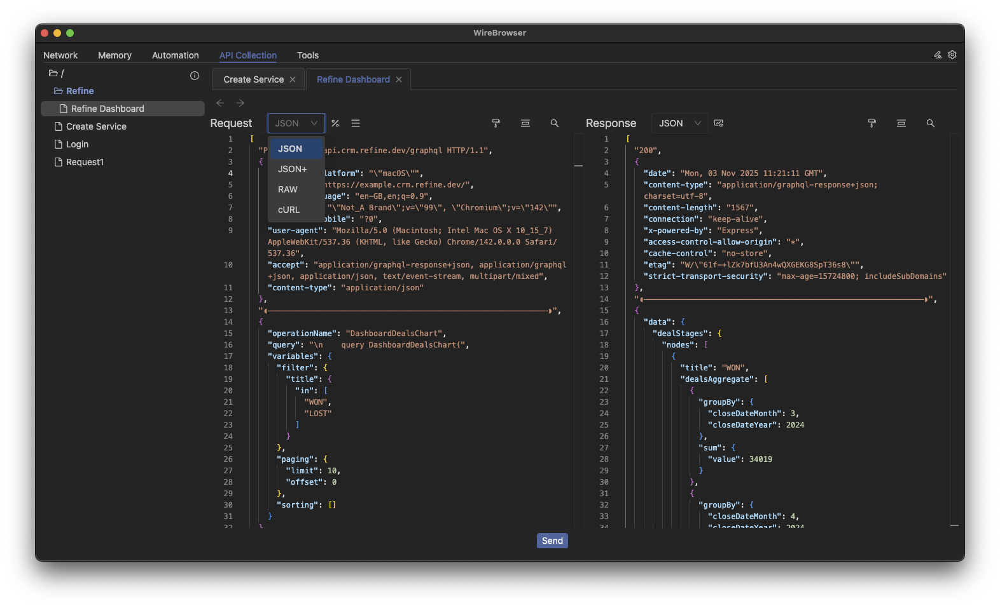

# Wirebrowser


**Wirebrowser** is a unified debugging and automation suite built on top of the **Chrome DevTools Protocol (CDP)**.

Its mission is to bring together the most valuable workflows from tools like **Burp Suite**, **Postman**, and **Chrome DevTools**, and extend them in ways that simplify real-world investigation and testing. Wirebrowser already exposes unique capabilities — notably full-text **Heap Snapshot search** with regex — and focuses on making interception, inspection, modification and automated testing of browser and API behaviour seamless in a single extensible tool.

Wirebrowser is aimed at developers, QA engineers, security researchers and pentesters who need to observe, manipulate and validate web and API flows — including the ability to rewrite requests and responses to test UI/UX and edge cases.

---

## ⚙️ What’s coming

Planned future capabilities include tighter DOM-level analysis (XSS scanning) and SPA crawling powered by existing open-source tooling (examples: [domdig](https://github.com/fcavallarin/domdig), [htcrawl](https://github.com/fcavallarin/htcrawl)). These will augment Wirebrowser’s inspection and automation features, keeping the project extensible and community-driven.

---

## 🧭 Overview

Wirebrowser is divided into **5 main sections**, each containing specialized tools:

1. **Network** – intercept, block, rewrite, and replay network requests.  
2. **Memory** – inspect memory, capture heap snapshots, and explore runtime objects.  
3. **Automation** – run browser and Node.js scripts manually or automatically.  
4. **API Collection** – create and run API requests with variable support, like Postman.  
5. **Tools** – utility tools such as encoders/decoders and JWT creator/verifier.


### 🌐 Interceptor


### 🧠 Heap Snapshot Search


### ▶️ API Collection



---


## Getting Started
### Install

```bash
git clone https://github.com/fcavallarin/wirebrowser.git
cd wirebrowser
npm install
npm run build
```

### Run
```bash
npm run wirebrowser
```

### 🐧 Linux - Sandbox issue with Electron
On some Linux distributions, Electron may fail to start due to process sandboxing restrictions, showing errors such as:

```
The SUID sandbox helper binary was found, but is not configured correctly.
```

This is a known issue in Electron ([https://github.com/electron/electron/issues/42510]).  
The most common solution is to disable AppArmor restrictions:

```
sudo sysctl -w kernel.apparmor_restrict_unprivileged_userns=1
```

---

## ✨ Features

### 1. Network

#### 🔹 Network Interceptor  
Capture and inspect all network requests in real time.  
- Intercept, **block**, or **rewrite** requests and responses on the fly.  
- Similar to **Burp Suite**, but with full **response modification support**.  
- Ideal for debugging web apps, testing security, or simulating server responses.  

#### 🔹 Network Repeater  
Replay previously captured requests.  
- Functions identically to **Burp’s Repeater**.  
- Supports **variables** (e.g., `{{baseUrl}}`, `{{token}}`).  
- Allows fine-grained editing and re-sending of captured requests.  
- Perfect for API testing and behavioral analysis.

---

### 2. Memory
Search objects in the browser's memory. Results are displayed as JSON within the **Monaco Editor** — with syntax highlighting, folding, and VSCode-like features.

#### 🔹 Memory Heap Snapshot  
- Capture heap snapshots directly via CDP.  
- Search for objects by **key**, **value** with **regular expressions** support.  

#### 🔹 Memory Runtime Objects  
- Search for objects starting from a specified root (e.g. `window` or `window.myObject`).  
- Useful for runtime inspection and reverse-engineering object graphs.

#### 🔹 Memory Class Instances  
- Uses CDP’s **queryObjects** feature to list all objects that share a given prototype.  
- Helps detect memory leaks and analyze object lifecycles.

---

### 3. Automation

Automation enables both **in-browser** and **Node.js** scripting for powerful debugging and dynamic testing.  
Scripts are organized in files and folders.  

#### 🔹 Automation Scripts  
- Run scripts manually or automatically (e.g., *on page creation*, *on page load*, etc.).  
- Access the full browser context (DOM, window, etc.).

#### 🔹 Automation Node Scripts  
- Run scripts in the **Node.js** environment.  
- Gives access to raw **Puppeteer** objects and CDP features.  
- Ideal for advanced automation, data collection, or environment setup.

```js
const userId = Utils.getVar("userId");
const page = Utils.getPage(1);
page.on("request", req => req.continue());
await page.goto(`https://example.com/${userId}`);
```

---

### 4. API Collection

- A complete API testing tool similar to **Postman**.  
- Organize API requests into collections, folders, and files.  
- Supports **variables** (e.g., `{{baseUrl}}`, `{{token}}`).  
- Edit headers, parameters, and payloads with ease.  
- Combine with **Network Repeater** for full control of client-server interactions.

---

### 5. Tools

#### 🔹 Decoder  
- Encode or decode strings in multiple formats:  
  - Base64  
  - URL encode/decode  
  - HTML entities  
  - Base36  

#### 🔹 JWT Tool  
- Create, verify, and decode **JSON Web Tokens (JWTs)**.  
- Displays header, payload, and signature sections clearly.

---

## ▶️ Scope of actions — Global vs Tab-specific

Most Wirebrowser actions can be performed **either globally (across all open tabs/pages)** or **targeted to a single tab**. This lets you choose whether a rule or inspection should affect the whole browser session or only a specific page.  
Every tab/page opened by Wirebrowser has a unique integer `tabId`. Use this `tabId` to scope actions.


**UI Notes**
- Many panels offer a **scope selector** (Global / Specific Tab ID) for quick changes.

---

## ❓ Why Wirebrowser?

Powerful tools like Chrome DevTools, Burp Suite, and Postman solve specific parts of a workflow — but they run in isolation. You inspect HTTP with one tool, debug memory in another, and trigger tests or automations with yet another one. This fragmentation makes real-world debugging slow, repetitive, and error-prone.

**Wirebrowser unifies these workflows** and extends them with distinctive capabilities like:

- 🔎 **Full-text Heap Snapshot search with regex** — find objects by value, even in deep or unreachable memory.
- 🌐 **Intercept, modify, and replay requests/responses** — like Burp, but  browser-native.
- 🛠️ **API editing in JSON, RAW, or cURL formats** — without leaving the tool.
- ⚡ **Built-in scripting and CDP hooks** — ideal for automation, fuzzing, or browser testing flows.
- 🧰 **One environment for network, memory, and automation tasks** — no context switching.
- 🔁 **Replay UI changes by modifying responses** — test edge cases directly in the browser.
- ⚙️ **Script-friendly architecture**, exposing structured JSON data and CDP hooks. 

Wirebrowser accelerates the everyday workflows of developers, QA engineers, security researchers, and pentesters — especially where other tools fall short or require manual glue code.

---

## 🚫 What Wirebrowser is not

Wirebrowser is not a full replacement for tools like Burp Suite, Postman, or Chrome DevTools:

- ❌ It is **not** a complete web proxy with active scanning modules (yet).
- ❌ It is **not** a front-end debugger with DOM inspector, CSS tools, or breakpoints.
- ❌ It is **not** a Postman competitor with public APIs, cloud workspaces, or auth flows.

Instead, Wirebrowser focuses on **unifying the 20% of features that solve 80% of debugging and investigation workflows** — and enhancing them with memory analysis, automation, and CDP-powered capabilities you won’t find in any single tool today.

The goal is not to replace those tools — but to make their most useful capabilities more seamless, scriptable, and powerful in one place.

---


## 🛠 Tech Stack

- **Frontend (UI):** [React](https://react.dev/)  
- **Backend:** [Node.js](https://nodejs.org/)  
- **Language:** Plain **JavaScript** (no TypeScript)  

Wirebrowser is built with React and Node.js, using **plain JavaScript** to keep the codebase lightweight and hackable.  
TypeScript or JSDoc-based typing may be introduced in the future for enhanced maintainability.

---

## 🗺 Roadmap

Planned and potential upcoming features for Wirebrowser:

### 🧠 Memory Tools
- Object reference visualization  
- Heap diffing between snapshots  

### 🌐 Network Tools
- Advanced rewrite rules and scripting hooks  
- Export/import of intercepted sessions  


### ⚙️ Collaboration
- Git integration for exporting and versioning projects
- Secrets management
- Integration with external APIs (Slack, Discord, etc.)  

### 🔎 Security & Crawling
- **SPA crawling** — automatic crawling of single-page applications, handling client-side routing and dynamic content.  
- **DOM XSS scanning** — automated scanning for DOM-based cross-site scripting vectors during crawls or on-demand.

### 🧰 Developer Experience
- Optional TypeScript migration  
- Plugin system for custom panels or scripts  
- Improved dark/light themes  

---

## 🤝 Community & Support

Wirebrowser is being built in the open — contributions and feedback are welcome!

- 💬 Chat coming soon (Discord or Matrix)
- 🐦 Follow updates on X/Twitter: https://x.com/wirebrowser
- 🧠 Issues & Ideas: https://github.com/fcavallarin/wirebrowser/issues

---

## 🤝 Contributing

Contributions and pull requests are welcome!  
Open an issue or pull request — even small suggestions help improve Wirebrowser.

---

## 📜 License

Wirebrowser™ is distributed under the **MIT License**.  
See the [LICENSE](LICENSE) file for more details.
